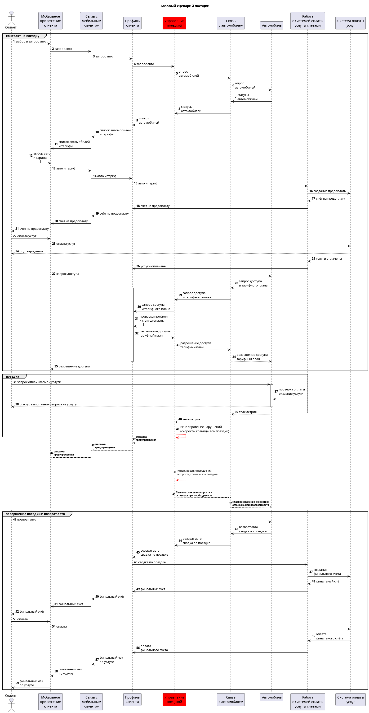
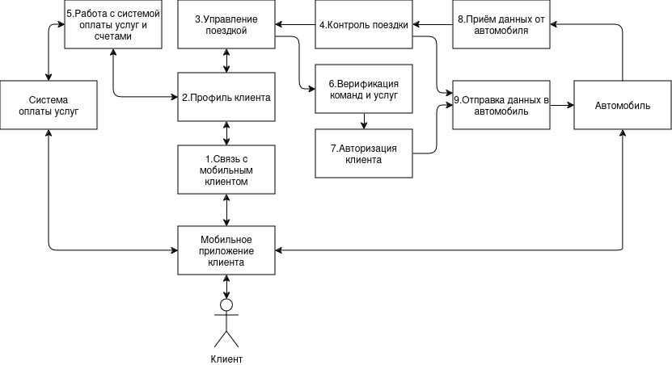
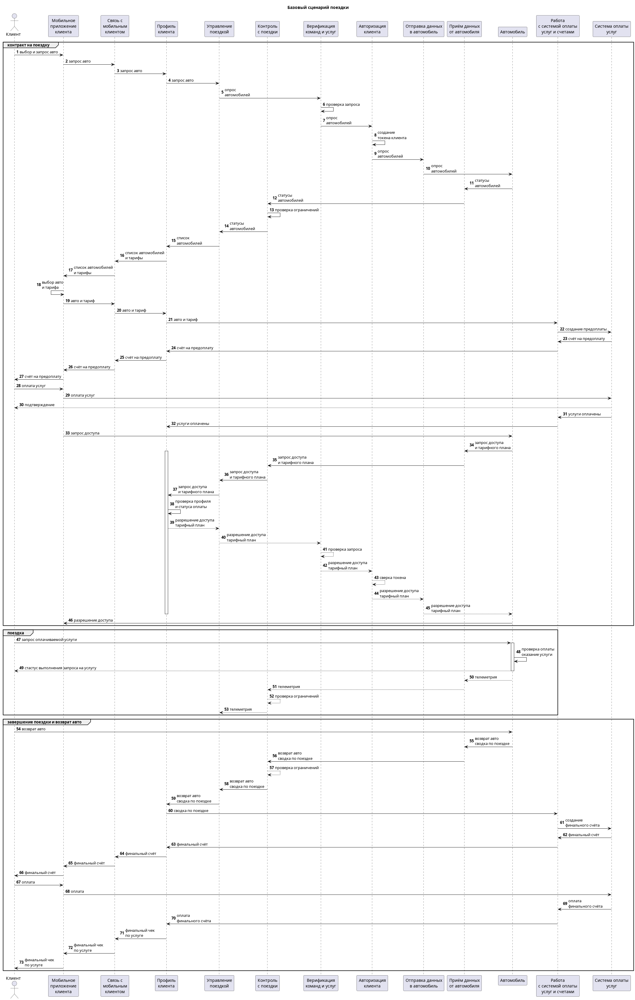
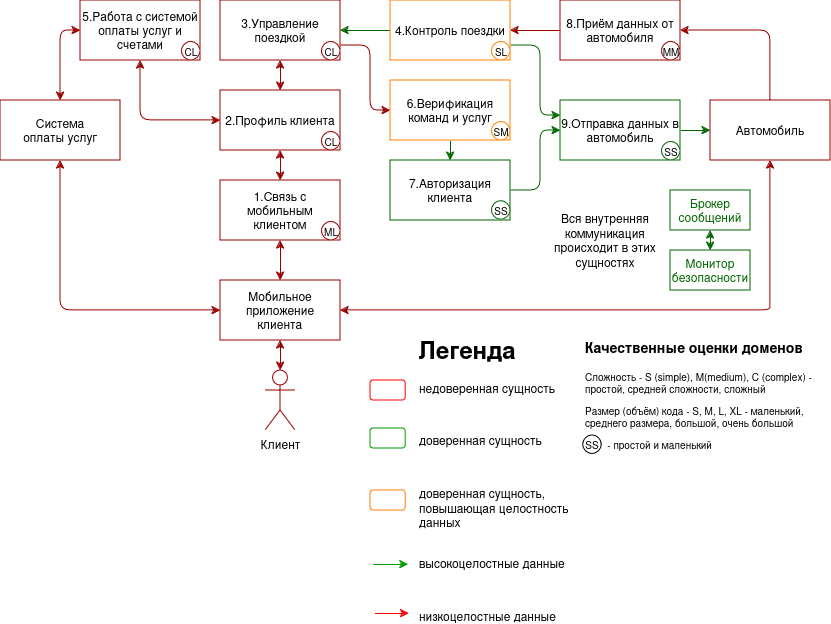
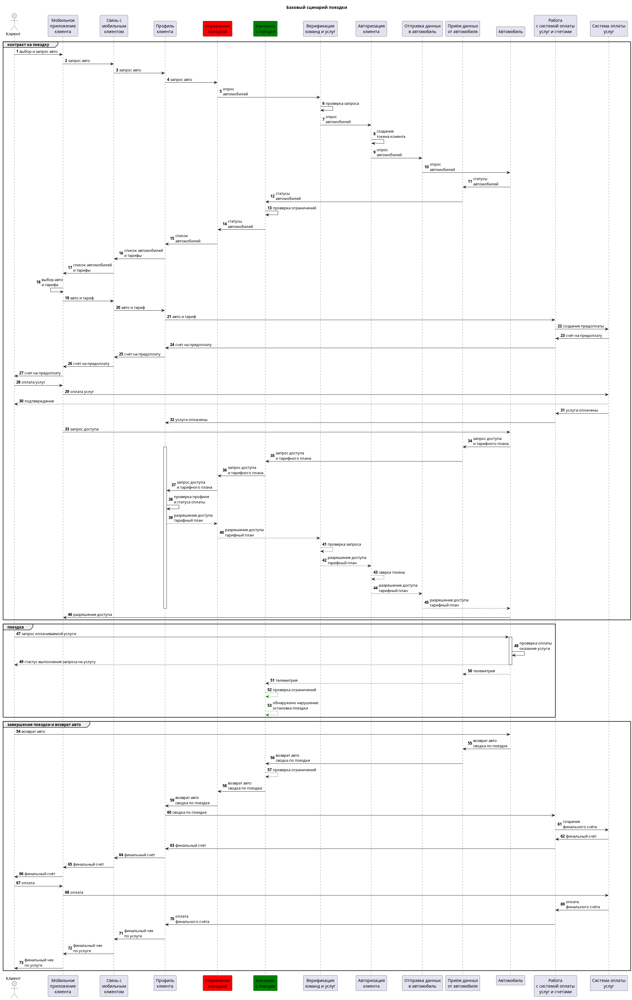
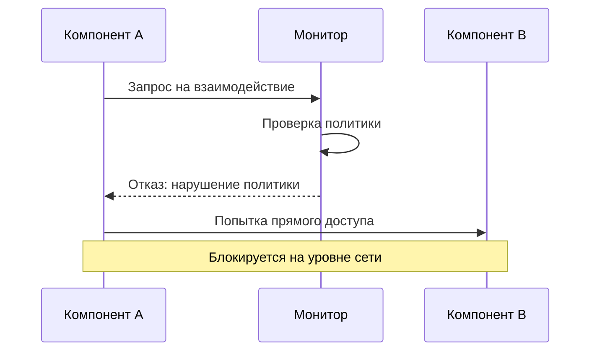
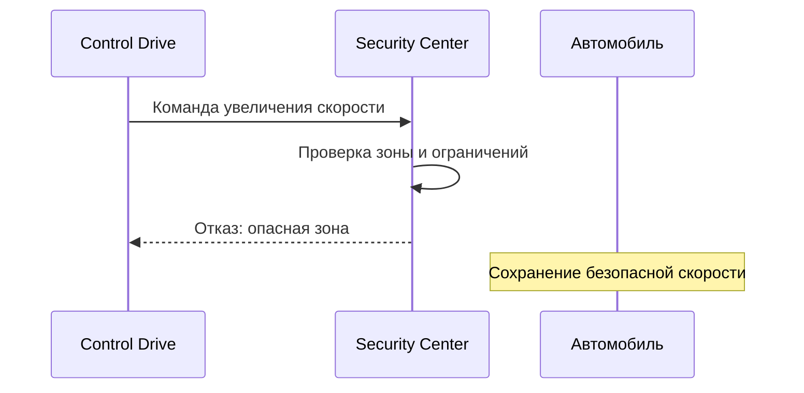

# Отчёт о выполнении задачи "Система управления парком автомобилей"

- [Отчёт о выполнении задачи "Система управления парком автомобилей"](#отчёт-о-выполнении-задачи-name)
  - [Постановка задачи](#постановка-задачи)
  - [Известные ограничения и вводные условия](#известные-ограничения-и-вводные-условия)
    - [Цели и Предположения Безопасности (ЦПБ)](#цели-и-предположения-безопасности-цпб)
  - [Архитектура системы](#архитектура-системы)
    - [Контекст работы системы](#контекст-работы-системы)
    - [Компоненты](#компоненты)
    - [Алгоритм работы решения](#алгоритм-работы-решения)
    - [Описание Сценариев (последовательности выполнения операций), при которых ЦБ нарушаются](#описание-сценариев-последовательности-выполнения-операций-при-которых-цб-нарушаются)
    - [Переработанная архитектура](#переработанная-архитектура)
    - [Указание "доверенных компонент" на архитектурной диаграмме.](#указание-доверенных-компонент-на-архитектурной-диаграмме)
    - [Проверка негативных сценариев](#проверка-негативных-сценариев)
    - [Политики безопасности](#политики-безопасности)
  - [Запуск приложения и тестов](#запуск-приложения-и-тестов)
    - [Запуск приложения](#запуск-приложения)
    - [Запуск тестов](#запуск-тестов)

## Постановка задачи

Компания разрабатывает подсистему удалённого управления ключевыми функциями для нового легкового автомобиля. Основной сценарий эксплуатации - каршэринг - совместное использование автомобиля широким кругом лиц, которые оплачивают подписку на различные наборы сервисов.

Необходимо обеспечить гибкое управление функционалом автомобиля таким образом, чтобы только аутентичный и авторизованный пользователь мог управлять автомобилем в соответствии со своей подпиской.

Отдельные функции, такие как, например, принудительная блокировка двигателя, отключение освещения, могут привести к аварии и ущербу для жизни и здоровья пассажиров в случае если это происходит во время движения.

Программного обеспечения в системе становится критически много, а сроки разработки сжатые, производителю необходимо выпустить свой автомобиль на рынок быстрее конкурентов, чтобы захватить большую долю рынка.

Необходимо **спроектировать систему удалённого управления** устойчивой к атакам как снаружи, так и изнутри системы, чтобы снизить требования к производителям сторонних подсистем и собственным разработчикам - это позволит ускорить и удешевить процесс разработки.

В рамках хакатона участникам предлагается:

- доработать предложенную архитектуру (см. далее) системы управления парком автомобилей с учётом целей безопасности
- декомпозировать систему и отделить критический для целей безопасности код
- в ПО нужно внедрить компонент "монитор безопасности" и реализовать контроль взаимодействия всех подсистем управления парком автомобилей
- доработать функциональный прототип
- создать автоматизированные тесты, демонстрирующие работу механизмов защиты

Ценности, ущербы и неприемлемые события

|Ценность|Неприемлемое событие|Оценка ущерба|Комментарий|
|:--|:--|:--|:--|
|Люди-клиенты|в результате критического сбоя в системе управления пострадали клиенты|высокий||
|Другие люди|в результате критического сбоя в системе управления пострадали другие люди (пешеходы, водители других авто)|высокий||
|Автомобиль|в результате критического сбоя в системе управления пострадал автомобиль|средний|Автомобиль застрахован|
|Имущество третьих лиц|в результате критического сбоя в системе управления пострадало имущество третьих лиц / важная инфраструктура|высокий||
|Операционная прибыль|злоумышленники получили неавторизованный доступ к функциям|высокий||

## Известные ограничения и вводные условия

- По условиям организаторов должна использоваться микросервисная архитектура и брокер сообщений для реализации асинхронной работы сервисов.
- Между собой сервисы Системы управления парком автомобилей общаются через брокер сообщений, а все внешнее взаимодействие происходит в виде REST запросов.
- Графический интерфейс для взаимодействия с пользователем не требуется, достаточно примеров REST запросов.

### Цели и Предположения Безопасности (ЦПБ)

Цели безопасности:

1. При любых обстоятельствах поездки осуществляются только авторизованными клиентами
2. При любых обстоятельствах используются только авторизованные услуги
3. При любых обстоятельствах клиентами используются только авторизованные команды
4. При любых обстоятельствах поездки осуществляются с соблюдением скоростных ограничений
5. При любых обстоятельствах поездки осуществляются только в пределах авторизованных районов оказания услуг

Предположения безопасности:

1. 
2. 
3. 

## Архитектура системы

### Контекст работы системы

Взаимодействие системы


Сценарий работы


### Компоненты

Система состоит из следующих основных компонентов:

1. **Управление автомобилями (cars)**
   - Содержит логику управления автомобилями
   - Включает конфигурационные файлы и данные
   - Реализует базовые функции управления автомобилем

2. **Система управления (management-system)**
   - Модульная архитектура с различными компонентами:
     - Monitor: отслеживает и контролирует безопасность системы
     - Auth: обеспечивает аутентификацию и авторизацию
     - Broker: управляет обменом сообщениями между компонентами
   - Содержит общие (shared) компоненты для всей системы

3. **Платёжная система (payment-system)**
   - Обрабатывает все финансовые операции
   - Имеет собственную конфигурацию и исходный код
   - Взаимодействует с другими компонентами через брокер сообщений

4. **Мобильный клиент (mobile-client)**
   - Предоставляет интерфейс для конечных пользователей
   - Взаимодействует с системой управления для выполнения операций

### Алгоритм работы решения

1. Система использует Kafka в качестве брокера сообщений для обеспечения надёжной коммуникации между компонентами
2. Zookeeper обеспечивает координацию и управление конфигурацией для Kafka
3. Все компоненты системы запускаются в отдельных контейнерах Docker для изоляции
4. Монитор безопасности контролирует все взаимодействия между компонентами
5. Аутентификация и авторизация выполняются перед любыми операциями управления
6. Платёжная система проверяет возможность выполнения платных операций
7. Управление автомобилями осуществляется только после проверки всех необходимых условий

### Описание Сценариев (последовательности выполнения операций), при которых ЦБ нарушаются

Нарушение ЦБ (Целей безопасности) в базовом решении

Напоминание ЦБ:

1. При любых обстоятельствах поездки осуществляются только авторизованными клиентами
2. При любых обстоятельствах используются только авторизованные услуги
3. При любых обстоятельствах клиентами используются только авторизованные команды
4. При любых обстоятельствах поездки осуществляются с соблюдением скоростных ограничений
5. При любых обстоятельствах поездки осуществляются только в пределах авторизованных районов оказания услуг

|Атакованный компонент|ЦБ1|ЦБ2|ЦБ3|ЦБ4|ЦБ5|Кол-во нарушений|
|:--|:-:|:-:|:-:|:-:|:-:|:-:|
|1. Связь с мобильным клиентом|🔴|🔴|🔴|🟢|🟢|3/5|
|2. Профиль клиента|🔴|🔴|🔴|🟢|🟢|3/5|
|3. Управление поездкой|🔴|🔴|🔴|🔴|🔴|5/5|
|4. Связь с автомобилем|🔴|🔴|🔴|🔴|🔴|5/5|
|5. Работа с системой оплаты услуг и счетами|🟢|🟢|🟢|🟢|🟢|0/5|

🟢 - ЦБ не нарушена 🔴 - ЦБ нарушена

|Название сценария|Описание|
|---|----------------------|
|НС-1|Модуль управления автомобилем был скомпроментирован и не реагировал на нарушения скоростного режима и пределов авторизированного района, что нарушает ЦБ 4, 5|

**Негативный сценарий - НС-1:**



## Переработанная архитектура



### Таблица новых компонентов

|Компонент|Описание|Комментарий|
|:---|:--|:--|
|4. Контроль поездки|Проверяет скоростные и районные ограничения для поездки|В случае не соблюдения требований 3 раза подряд, принудительно завершает поездку клиента|
|6. Верификация команд и услуг|Проверяет разрешенные команды и услуги запрашиваемые к исполнению|В случае если команда или услуга не проходит проверку, то пропускает их|
|7. Авторизация клиента|Создание и проверка токена клиента|Авторизации клиента в системе|
|8. Приём данных от автомобиля|Получает данные от автомобиля||
|9. Отправка данных в автомобиль|Отправляет данные в автомобиль|Передача происходит по защищенном каналу связи|

### Диаграмма последовательности

#### Выполнение базового сценария



## Указание "доверенных компонент" на архитектурной диаграмме



#### Таблица доверенных компонентов

|Компонент|Уровень доверия|Обоснование|Комментарий|
|:--|:--|:--|:--|
|1. Связь с мобильным клиентом|$\textcolor{red}{\textsf{Недоверенный}}$|||
|2. Профиль клиента|$\textcolor{red}{\textsf{Недоверенный}}$|||
|3. Управление поездкой|$\textcolor{red}{\textsf{Недоверенный}}$|||
|4. Контроль поездки|$\textcolor{orange}{\textsf{Доверенный}}$|Соблюдение ЦБ 2, 3||
|5. Работа с системой оплаты услуг и счетами|$\textcolor{red}{\textsf{Недоверенный}}$|||
|6. Верификация команд и услуг|$\textcolor{orange}{\textsf{Доверенный}}$|Соблюдение ЦБ 4, 5||
|7. Авторизация клиента|$\textcolor{green}{\textsf{Доверенный}}$|Соблюдение ЦБ 1||
|8. Приём данных от автомобиля|$\textcolor{red}{\textsf{Недоверенный}}$|||
|9. Отправка данных в автомобиль|$\textcolor{green}{\textsf{Доверенный}}$|Соблюдение ЦБ 1, 2, 3, 4, 5||

#### Качественная оценка доменов

|Компонент|Уровень доверия|Оценка|Кол-во входящих интерфейсов|Комментарий|
|:--|:-:|:-:|:-:|:--|
|1. Связь с мобильным клиентом|$\textcolor{red}{\textsf{Недоверенный}}$|ML|2||
|2. Профиль клиента|$\textcolor{red}{\textsf{Недоверенный}}$|CL|3||
|3. Управление поездкой|$\textcolor{red}{\textsf{Недоверенный}}$|CL|2||
|4. Контроль поездки|$\textcolor{orange}{\textsf{Доверенный}}$|SL|1||
|5. Работа с системой оплаты услуг и счетами|$\textcolor{red}{\textsf{Недоверенный}}$|CL|2||
|6. Верификация команд и услуг|$\textcolor{orange}{\textsf{Доверенный}}$|SM|1|Проверка команд по whitelist|
|7. Авторизация клиента|$\textcolor{green}{\textsf{Доверенный}}$|SS|1|Создание уникальных токенов клиента и сверка его с последующими запросами|
|8. Приём данных от автомобиля|$\textcolor{red}{\textsf{Недоверенный}}$|MM|1||
|9. Отправка данных в автомобиль|$\textcolor{green}{\textsf{Доверенный}}$|SL|2|Отправка данных или команд по защищенному каналу связи|

### Проверка негативных сценариев

|Название сценария|Описание|
|---|---------|
|НС-1|Тест Негативного сценария 1. Модуль управления автомобилем скомпроментирован, но так как ввёден модуль контроля поездки и он отслеживает скоростной режим и границы авторизированного района и в случае нарушения завершает поездку (завершение поездки не нарушает ЦБ), ЦБ не нарушаются|

**Негативный сценарий - НС-1:**



|Компонент|Соответствие|
|-----|-----|
|1. Связь с мобильным клиентом|com-mobile|
|2. Профиль клиента|profile-client|
|3. Управление поездкой|manage-drive|
|4. Контроль поездки|control-drive|
|5. Работа с системой оплаты услуг и счетами|bank-pay|
|6. Верификация команд и услуг|verify|
|7. Авторизация клиента|auth|
|8. Приём данных от автомобиля|receiver-car|
|9. Отправка данных в автомобиль|sender-car|
|Автомобиль|cars|
|Система оплаты услуг|payment-system|
|Мобильное приложение клиента|mobile-client|

### Политики безопасности

```python {lineNo:true}
policies = (
    {"src": "com-mobile", "dst": "profile-client"},
    {"src": "profile-client", "dst": "com-mobile"},
    {"src": "profile-client", "dst": "manage-drive"},
    {"src": "profile-client", "dst": "bank-pay"},
    {"src": "manage-drive", "dst": "profile-client"},
    {"src": "bank-pay", "dst": "profile-client"},
    {"src": "manage-drive", "dst": "verify"},
    {"src": "verify", "dst": "auth"},
    {"src": "auth", "dst": "sender-car"},
    {"src": "receiver-car", "dst": "control-drive"},
    {"src": "control-drive", "dst": "sender-car"},
    {"src": "control-drive", "dst": "manage-drive"}
)


def check_operation(id, details) -> bool:
    """ Проверка возможности совершения обращения. """
    src: str = details.get("source")
    dst: str = details.get("deliver_to")

    if not all((src, dst)):
        return False

    print(f"[info] checking policies for event {id}, {src}->{dst}")

    return {"src": src, "dst": dst} in policies

## Запуск приложения и тестов

### Запуск приложения

Для запуска приложения необходимо выполнить следующие шаги:

1. Установить зависимости:
```bash
python3 -m venv .venv
.venv/bin/python3 -m pip install -U pip
.venv/bin/pip install -r requirements.txt
```

2. Запустить все сервисы:
```bash
make all
```

Это выполнит следующие действия:
- Остановит существующие контейнеры Kafka
- Пересоберет и запустит все контейнеры через docker-compose
- Создаст необходимые топики Kafka
- Дождется полной инициализации системы

### Запуск тестов

В системе реализованы два типа тестов:

1. Функциональные тесты (e2e):
```bash
make test
```
Эти тесты проверяют полный цикл работы системы:
- Регистрацию автомобиля
- Создание предоплаты
- Начало поездки
- Завершение поездки
- Финальную оплату

2. Тесты безопасности:
```bash
make test_security
```
Тесты безопасности проверяют:
- Политики взаимодействия компонентов
- Контроль запрещенных зон
- Обработку предупреждений о зонах
- Последовательности операций безопасности

## Архитектура системы и обоснование выбора доверенных компонент

### Таблица доверенных компонент

| Компонент | Уровень доверия | Обоснование | Ссылка на сценарий угрозы |
|-----------|-----------------|-------------|---------------------------|
| Monitor (Монитор безопасности) | Высокий | Критический компонент для проверки всех взаимодействий. Минимальный код, только проверка политик. | Сценарий 1: Попытка прямого взаимодействия компонентов |
| Security Center | Высокий | Управляет критичными параметрами безопасности (скорость, зоны). Изолированная логика проверок. | Сценарий 2: Превышение скорости в опасной зоне |
| Auth | Высокий | Контролирует доступ к системе. Минимальный код авторизации. | Сценарий 3: Неавторизованный доступ |
| Control Drive | Средний | Управляет движением, но проверяется монитором и Security Center | Сценарий 4: Опасные команды управления |
| Profile Client | Низкий | Некритичная информация о клиенте | - |
| Payment System | Низкий | Изолированная система оплаты | - |

### Диаграммы негативных сценариев

#### Сценарий 1: Попытка прямого взаимодействия компонентов


#### Сценарий 2: Превышение скорости в опасной зоне


### Минимизация доверенного кода

1. Монитор безопасности (Monitor):
   - Только проверка политик взаимодействия
   - Минимальный набор правил
   - Изоляция в отдельном контейнере

2. Security Center:
   - Отделенная логика проверки безопасности
   - Четко определенные зоны ответственности
   - Минимальный интерфейс взаимодействия

3. Auth:
   - Базовая логика авторизации
   - Изолированное хранение данных
   - Минимальный набор проверок
